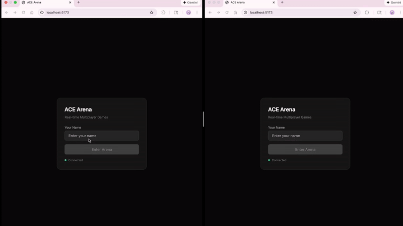

# ACE Arena

Real-time multiplayer game platform built with React, Node.js, and Socket.IO.


## DEMO



## Features

- **Real-time Multiplayer** - WebSocket-based instant communication
- **Matchmaking System** - Automatic opponent pairing via queue
- **Multiple Games** - Dice Duel & Rock Paper Scissors
- **Play vs AI** - Practice mode against computer
- **Live Leaderboard** - Real-time ranking updates
- **Activity Log** - Track all game events

## Architecture

```
┌─────────────┐      WebSocket      ┌─────────────┐
│   Player 1  │◄───────────────────►│             │
│   (React)   │                     │   Server    │
└─────────────┘                     │  (Node.js)  │
                                    │  Socket.IO  │
┌─────────────┐      WebSocket      │             │
│   Player 2  │◄───────────────────►│             │
│   (React)   │                     └─────────────┘
└─────────────┘
```

## Project Structure

```
ace-arena/
├── server.js              # Game server (Node.js + Socket.IO)
├── package.json           # Server dependencies
│
└── client/                # React frontend
    ├── index.html
    ├── package.json
    ├── vite.config.js
    ├── tailwind.config.js
    ├── postcss.config.js
    └── src/
        ├── main.tsx       # Entry point
        ├── index.css      # Tailwind imports
        └── App.tsx        # Main application
```

## Quick Start

### Prerequisites

- Node.js 18+
- npm or yarn

### Installation

```bash
# Clone the repo
git clone https://github.com/oyrqaq/ace-arena.git
cd ace-arena

# Install server dependencies
npm install

# Install client dependencies
cd client && npm install
```

### Running the App

```bash
# Terminal 1: Start the server
npm run dev

# Terminal 2: Start the client
cd client && npm run dev
```

Open http://localhost:5173 in your browser.

### Testing Multiplayer

1. Open **two browser windows** (or use incognito)
2. Enter different player names
3. Both players click the same game → "Find opponent"
4. Start playing in real-time! 🎮

## Game Modes

### Dice Duel
- Both players roll dice simultaneously
- Higher roll wins the round
- +10 points per win

### Rock Paper Scissors
- Classic RPS rules
- Both players choose simultaneously
- +15 points per win

## WebSocket Events

### Client → Server

| Event | Payload | Description |
|-------|---------|-------------|
| `register` | `{ name }` | Register player |
| `join_queue` | `{ gameType }` | Join matchmaking |
| `play_ai` | `{ gameType }` | Start AI game |
| `move` | `{ gameId, move }` | Make a move |
| `leave_game` | - | Exit current game |

### Server → Client

| Event | Payload | Description |
|-------|---------|-------------|
| `registered` | `{ playerId, name }` | Registration confirmed |
| `queued` | `{ position }` | Added to queue |
| `game_start` | `{ gameId, opponent }` | Match found |
| `round_result` | `{ yourMove, opponentMove, result }` | Round outcome |
| `opponent_left` | - | Opponent disconnected |

## Tech Stack

| Layer | Technology |
|-------|------------|
| Frontend | React 18, TypeScript, Vite, Tailwind CSS |
| Backend | Node.js, Express, Socket.IO |
| Protocol | WebSocket (Socket.IO) |

## Future Enhancements

- [ ] Redis for session management & horizontal scaling
- [ ] PostgreSQL for persistent leaderboards
- [ ] JWT authentication
- [ ] Room system (invite friends)
- [ ] Chat functionality
- [ ] More game modes (Blackjack, Poker)
- [ ] Docker deployment

## License

MIT License
